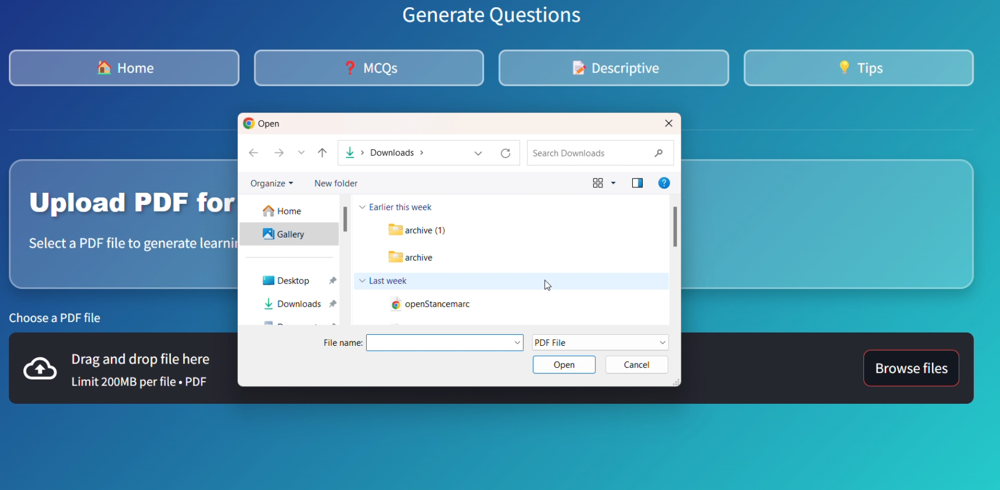

# GenQ: Automated Study Material Generation Tool

## Project Overview
GenQ is an innovative PDF analysis tool designed to revolutionize study material creation by automatically generating comprehensive questions from document content.

## Key Features
- Automatic PDF content extraction
- Multiple-choice question generation
- Descriptive question creation
- Intuitive user interface for question navigation and review

## Technologies Used
- Python
- Natural Language Processing
- Machine Learning
- PDF Parsing Libraries

## How It Works
1. Upload PDF document
2. Extract semantic content
3. Generate diverse question types
4. Review and customize generated questions

## 🎥 Demo  
Here’s how the app looks in action:  

<div style="display: flex; gap: 10px;">
  
  
  
  
  
</div>

## Installation
```bash
git clone https://github.com/RakeshTirlangi/GenQ.git
cd GenQ
pip install -r requirements.txt
```

## Usage
```python
from genq import QuestionGenerator

generator = QuestionGenerator('your_document.pdf')
questions = generator.generate_questions()
```

## Project Goals
- Streamline study material creation
- Enhance learning resources
- Reduce manual question preparation time
